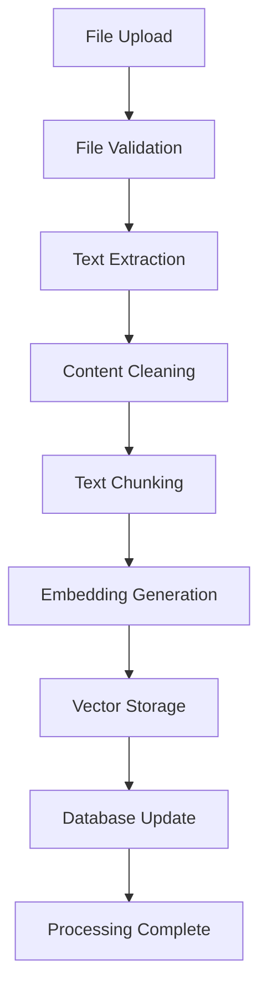
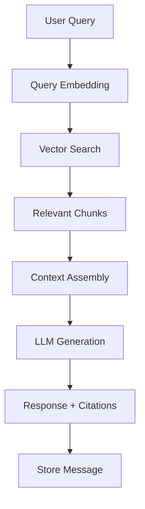
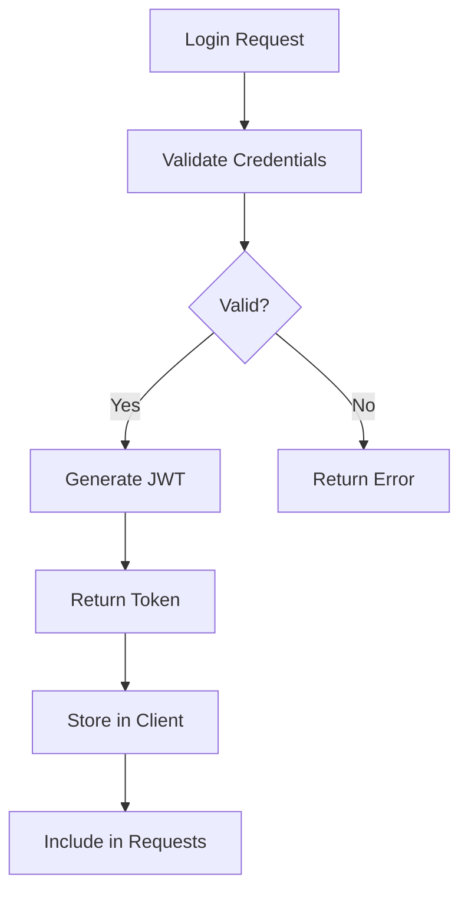

# RAG Chatbot - Comprehensive Knowledge Document

## 📋 **TABLE OF CONTENTS**

1. [Application Overview](#application-overview)
2. [Architecture & Design](#architecture--design)
3. [Technology Stack](#technology-stack)
4. [File Structure & Components](#file-structure--components)
5. [Database Schema](#database-schema)
6. [API Documentation](#api-documentation)
7. [Logic Flow](#logic-flow)
8. [Setup & Deployment](#setup--deployment)
9. [Configuration](#configuration)
10. [Security Features](#security-features)
11. [Performance & Optimization](#performance--optimization)
12. [Troubleshooting](#troubleshooting)

---

## 🎯 **APPLICATION OVERVIEW**

### **What is RAG Chatbot?**

RAG (Retrieval-Augmented Generation) Chatbot is a sophisticated AI-powered conversational system that combines document retrieval with large language models to provide contextually accurate responses based on uploaded documents.

### **Key Features**

- **Document Processing**: Upload and process PDF, Word, Excel, and text files
- **Intelligent Chunking**: Multiple chunking strategies (language-specific, semantic, fixed-size)
- **Vector Storage**: Efficient document embedding and retrieval
- **Multi-Model Support**: Integration with Google Gemini and OpenAI models
- **Context Management**: Organize documents into searchable contexts
- **Real-time Chat**: Interactive conversations with document-based responses
- **User Management**: Secure authentication and user isolation
- **Admin Dashboard**: System monitoring and management tools

### **Use Cases**

- **Knowledge Base Queries**: Ask questions about company documents
- **Research Assistance**: Get insights from academic papers
- **Document Analysis**: Extract information from large document sets
- **Customer Support**: Automated responses based on documentation
- **Educational Tools**: Interactive learning from textbooks and materials

---

## 🏗️ **ARCHITECTURE & DESIGN**

### **System Architecture**

```
┌─────────────────┐    ┌─────────────────┐    ┌─────────────────┐
│   Frontend      │    │   Backend       │    │   Database      │
│   (React/Vue)   │◄──►│   (Flask)       │◄──►│   (SQLite)      │
│   Port: 5173    │    │   Port: 5000    │    │   File-based    │
└─────────────────┘    └─────────────────┘    └─────────────────┘
                              │
                              ▼
                    ┌─────────────────┐
                    │   AI Services   │
                    │   (Gemini/GPT)  │
                    └─────────────────┘
```

### **Design Patterns**

1. **MVC Pattern**: Model-View-Controller separation
2. **Blueprint Pattern**: Modular route organization
3. **Repository Pattern**: Data access abstraction
4. **Factory Pattern**: Service instantiation
5. **Singleton Pattern**: Database connections

### **Data Flow**

```
User Input → Authentication → Context Selection → Document Upload → 
Text Extraction → Chunking → Embedding → Vector Storage → 
Query Processing → Retrieval → LLM Generation → Response
```

---

## 💻 **TECHNOLOGY STACK**

### **Backend Technologies**

| Component | Technology | Version | Purpose |
|-----------|------------|---------|---------|
| **Framework** | Flask | 3.0.0+ | Web application framework |
| **Database** | SQLAlchemy | 2.0.25+ | ORM and database management |
| **Authentication** | Flask-JWT-Extended | 4.6.0+ | JWT token management |
| **CORS** | Flask-CORS | 4.0.0+ | Cross-origin requests |
| **AI/ML** | Google Generative AI | 0.3.2+ | LLM integration |
| **Embeddings** | Sentence Transformers | 2.2.2+ | Text embeddings |
| **Vector DB** | FAISS | 1.7.4+ | Vector similarity search |
| **Document Processing** | python-docx, openpyxl | Latest | File parsing |

### **Frontend Technologies**

- **Framework**: React/Vue.js (configurable)
- **Build Tool**: Vite
- **Styling**: CSS3/Tailwind CSS
- **HTTP Client**: Axios/Fetch API

---

## 📁 **FILE STRUCTURE & COMPONENTS**

### **Backend Structure**

```
backend/
├── app_local.py              # Main application entry point
├── models.py                 # Database models and schemas
├── requirements.txt          # Python dependencies
├── .env.template            # Environment configuration template
├── KNOWLEDGE_DOCUMENT.md    # This documentation
├── FIXES_APPLIED.md         # Applied fixes documentation
│
├── routes/                  # API route blueprints
│   ├── __init__.py
│   ├── admin.py            # Admin management routes
│   ├── auth.py             # Authentication routes
│   ├── chat.py             # Chat and query routes
│   ├── contexts.py         # Context management routes
│   └── upload.py           # File upload routes
│
├── services/               # Business logic services
│   ├── __init__.py
│   ├── llm_service.py      # LLM integration service
│   ├── vector_service.py   # Vector storage service
│   ├── monitoring_service.py # System monitoring
│   └── context_cleanup_service.py # Context cleanup
│
├── performance/            # Performance optimization
│   ├── __init__.py
│   └── caching.py         # Caching mechanisms
│
├── models/                # Additional model components
│   ├── __init__.py
│   └── context_version.py # Context versioning
│
├── clients/               # API client libraries
│   ├── python_client.py   # Python API client
│   └── ragchatbot_client/ # CLI client package
│
├── uploads/               # File upload directory
├── vector_stores/         # Vector storage directory
└── instance/             # Flask instance folder
    └── ragchatbot.db     # SQLite database file
```

### **Frontend Structure**

```
frontend/
├── src/
│   ├── components/        # React/Vue components
│   │   ├── Auth/         # Authentication components
│   │   ├── Context/      # Context management
│   │   ├── Chat/         # Chat interface
│   │   └── Admin/        # Admin dashboard
│   ├── services/         # API service layer
│   ├── utils/           # Utility functions
│   └── styles/          # CSS/styling files
├── public/              # Static assets
└── package.json         # Node.js dependencies
```

---

## 🗄️ **DATABASE SCHEMA**

### **Core Tables**

#### **Users Table**
```sql
CREATE TABLE users (
    id INTEGER PRIMARY KEY,
    username VARCHAR(80) UNIQUE NOT NULL,
    email VARCHAR(120) UNIQUE NOT NULL,
    password_hash VARCHAR(255) NOT NULL,
    created_at DATETIME DEFAULT CURRENT_TIMESTAMP,
    is_active BOOLEAN DEFAULT TRUE
);
```

#### **Contexts Table**
```sql
CREATE TABLE contexts (
    id INTEGER PRIMARY KEY,
    name VARCHAR(255) NOT NULL,
    description TEXT,
    source_type VARCHAR(50) NOT NULL,
    chunk_strategy VARCHAR(50) DEFAULT 'language-specific',
    embedding_model VARCHAR(100) DEFAULT 'text-embedding-004',
    config TEXT,  -- JSON configuration
    status VARCHAR(50) DEFAULT 'pending',
    progress INTEGER DEFAULT 0,
    error_message TEXT,
    total_chunks INTEGER DEFAULT 0,
    total_tokens INTEGER DEFAULT 0,
    created_at DATETIME DEFAULT CURRENT_TIMESTAMP,
    updated_at DATETIME DEFAULT CURRENT_TIMESTAMP,
    user_id INTEGER NOT NULL,
    FOREIGN KEY (user_id) REFERENCES users(id)
);
```

#### **Documents Table**
```sql
CREATE TABLE documents (
    id INTEGER PRIMARY KEY,
    filename VARCHAR(255) NOT NULL,
    original_filename VARCHAR(255) NOT NULL,
    file_path VARCHAR(500) NOT NULL,
    file_size INTEGER,
    file_type VARCHAR(50),
    upload_date DATETIME DEFAULT CURRENT_TIMESTAMP,
    processing_status VARCHAR(50) DEFAULT 'pending',
    error_message TEXT,
    context_id INTEGER NOT NULL,
    FOREIGN KEY (context_id) REFERENCES contexts(id)
);
```

#### **Chat Sessions Table**
```sql
CREATE TABLE chat_sessions (
    id INTEGER PRIMARY KEY,
    title VARCHAR(255) NOT NULL,
    created_at DATETIME DEFAULT CURRENT_TIMESTAMP,
    updated_at DATETIME DEFAULT CURRENT_TIMESTAMP,
    user_id INTEGER NOT NULL,
    FOREIGN KEY (user_id) REFERENCES users(id)
);
```

#### **Messages Table**
```sql
CREATE TABLE messages (
    id INTEGER PRIMARY KEY,
    session_id INTEGER NOT NULL,
    role VARCHAR(20) NOT NULL,  -- 'user' or 'assistant'
    content TEXT NOT NULL,
    context_ids TEXT,  -- JSON array of context IDs
    citations TEXT,    -- JSON array of citations
    tokens_used INTEGER DEFAULT 0,
    model_used VARCHAR(100),
    created_at DATETIME DEFAULT CURRENT_TIMESTAMP,
    FOREIGN KEY (session_id) REFERENCES chat_sessions(id)
);
```

#### **Text Chunks Table**
```sql
CREATE TABLE text_chunks (
    id INTEGER PRIMARY KEY,
    context_id INTEGER NOT NULL,
    file_name VARCHAR(255) NOT NULL,
    chunk_index INTEGER NOT NULL,
    content TEXT NOT NULL,
    file_info TEXT,  -- JSON metadata
    created_at DATETIME DEFAULT CURRENT_TIMESTAMP,
    FOREIGN KEY (context_id) REFERENCES contexts(id)
);
```

### **Relationships**

- **User** → **Contexts** (One-to-Many)
- **User** → **Chat Sessions** (One-to-Many)
- **Context** → **Documents** (One-to-Many)
- **Context** → **Text Chunks** (One-to-Many)
- **Chat Session** → **Messages** (One-to-Many)

---

## 🔌 **API DOCUMENTATION**

### **Authentication Endpoints**

#### **POST /api/auth/register**
Register a new user account.

**Request Body:**
```json
{
    "username": "string",
    "email": "string",
    "password": "string"
}
```

**Response (201):**
```json
{
    "message": "User registered successfully",
    "user": {
        "id": 1,
        "username": "john_doe",
        "email": "john@example.com",
        "created_at": "2024-01-01T00:00:00Z"
    }
}
```

#### **POST /api/auth/login**
Authenticate user and get access token.

**Request Body:**
```json
{
    "username": "string",
    "password": "string"
}
```

**Response (200):**
```json
{
    "access_token": "eyJ0eXAiOiJKV1QiLCJhbGciOiJIUzI1NiJ9...",
    "user": {
        "id": 1,
        "username": "john_doe",
        "email": "john@example.com"
    }
}
```

### **Context Management Endpoints**

#### **GET /api/contexts**
Get all contexts for authenticated user.

**Headers:**
```
Authorization: Bearer <token>
```

**Response (200):**
```json
{
    "contexts": [
        {
            "id": 1,
            "name": "Research Papers",
            "description": "Academic research documents",
            "source_type": "files",
            "chunk_strategy": "language-specific",
            "embedding_model": "text-embedding-004",
            "status": "ready",
            "progress": 100,
            "total_chunks": 150,
            "total_tokens": 50000,
            "created_at": "2024-01-01T00:00:00Z"
        }
    ]
}
```

#### **POST /api/contexts**
Create a new context.

**Headers:**
```
Authorization: Bearer <token>
```

**Request Body:**
```json
{
    "name": "string",
    "description": "string",
    "source_type": "files",
    "chunk_strategy": "language-specific",
    "embedding_model": "text-embedding-004",
    "config": {}
}
```

**Response (201):**
```json
{
    "message": "Context created successfully",
    "context": {
        "id": 1,
        "name": "Research Papers",
        "status": "pending"
    }
}
```

#### **GET /api/contexts/{id}**
Get specific context details.

**Response (200):**
```json
{
    "context": {
        "id": 1,
        "name": "Research Papers",
        "description": "Academic research documents",
        "documents": [
            {
                "id": 1,
                "filename": "paper1.pdf",
                "file_size": 1024000,
                "upload_date": "2024-01-01T00:00:00Z",
                "processing_status": "completed"
            }
        ],
        "config": {
            "chunk_strategy": "language-specific",
            "embedding_model": "text-embedding-004"
        }
    }
}
```

#### **DELETE /api/contexts/{id}**
Delete a context and all associated data.

**Response (200):**
```json
{
    "message": "Context deleted successfully",
    "cleanup_stats": {
        "vector_stores_deleted": 1,
        "documents_deleted": 5,
        "files_deleted": 1,
        "chunks_deleted": 150
    }
}
```

### **File Upload Endpoints**

#### **POST /api/upload/files**
Upload files to a context.

**Headers:**
```
Authorization: Bearer <token>
Content-Type: multipart/form-data
```

**Form Data:**
```
files: File[]
context_id: integer
```

**Response (200):**
```json
{
    "message": "Files uploaded successfully",
    "files_processed": 3,
    "total_chunks": 45,
    "processing_time": 12.5
}
```

### **Chat Endpoints**

#### **POST /api/chat/query**
Send a chat query with context.

**Headers:**
```
Authorization: Bearer <token>
```

**Request Body:**
```json
{
    "message": "What are the main findings in the research?",
    "context_ids": [1, 2],
    "session_id": 1,
    "model": "gemini-pro"
}
```

**Response (200):**
```json
{
    "response": "Based on the research documents, the main findings are...",
    "citations": [
        {
            "document": "paper1.pdf",
            "chunk": "The study shows that...",
            "relevance_score": 0.95
        }
    ],
    "tokens_used": 150,
    "model_used": "gemini-pro"
}
```

#### **GET /api/chat/sessions**
Get chat sessions for user.

**Response (200):**
```json
{
    "sessions": [
        {
            "id": 1,
            "title": "Research Discussion",
            "created_at": "2024-01-01T00:00:00Z",
            "message_count": 10
        }
    ]
}
```

#### **GET /api/chat/sessions/{id}/messages**
Get messages for a chat session.

**Response (200):**
```json
{
    "messages": [
        {
            "id": 1,
            "role": "user",
            "content": "What are the main findings?",
            "created_at": "2024-01-01T00:00:00Z"
        },
        {
            "id": 2,
            "role": "assistant",
            "content": "The main findings are...",
            "citations": [...],
            "created_at": "2024-01-01T00:00:00Z"
        }
    ]
}
```

### **Admin Endpoints**

#### **GET /api/admin/dashboard**
Get system dashboard data (admin only).

**Response (200):**
```json
{
    "system_stats": {
        "total_users": 50,
        "total_contexts": 200,
        "total_documents": 1000,
        "total_chunks": 50000
    },
    "performance_metrics": {
        "cpu_usage": 45.2,
        "memory_usage": 67.8,
        "disk_usage": 23.1
    },
    "recent_activity": [...]
}
```

### **Health Check Endpoints**

#### **GET /api/health**
Check application health status.

**Response (200):**
```json
{
    "status": "healthy",
    "timestamp": "2024-01-01T00:00:00Z",
    "version": "1.0.0",
    "database": "connected",
    "services": {
        "llm_service": "available",
        "vector_service": "available"
    }
}
```

---

## 🔄 **LOGIC FLOW**

### **Document Processing Flow**



### **Query Processing Flow**



### **Authentication Flow**



---

## 📦 **SETUP & DEPLOYMENT**

### **Prerequisites**

- **Python**: 3.10+ (recommended 3.11)
- **Node.js**: 16+ (for frontend)
- **Git**: Latest version
- **Operating System**: Windows, macOS, or Linux

### **Local Development Setup**

#### **1. Clone Repository**
```bash
git clone <repository-url>
cd myrag
```

#### **2. Backend Setup**
```bash
cd backend

# Create virtual environment
python -m venv venv

# Activate virtual environment
# Windows:
venv\Scripts\activate
# macOS/Linux:
source venv/bin/activate

# Install dependencies
pip install -r requirements.txt

# Create environment file
cp .env.template .env
# Edit .env with your configuration
```

#### **3. Database Setup**
```bash
# Initialize database
python -c "from app_local import app, db; app.app_context().push(); db.create_all(); print('Database created')"

# Verify setup
python test_all_fixes.py
```

#### **4. Frontend Setup**
```bash
cd ../frontend

# Install dependencies
npm install

# Start development server
npm run dev
```

#### **5. Start Backend Server**
```bash
cd ../backend
python app_local.py
```

### **Production Deployment**

#### **Docker Deployment**

**Dockerfile (Backend):**
```dockerfile
FROM python:3.11-slim

WORKDIR /app

COPY requirements.txt .
RUN pip install --no-cache-dir -r requirements.txt

COPY . .

EXPOSE 5000

CMD ["gunicorn", "--bind", "0.0.0.0:5000", "app_local:app"]
```

**docker-compose.yml:**
```yaml
version: '3.8'
services:
  backend:
    build: ./backend
    ports:
      - "5000:5000"
    environment:
      - DATABASE_URL=sqlite:///ragchatbot.db
      - JWT_SECRET_KEY=${JWT_SECRET_KEY}
    volumes:
      - ./data:/app/instance
      - ./uploads:/app/uploads

  frontend:
    build: ./frontend
    ports:
      - "80:80"
    depends_on:
      - backend
```

#### **Cloud Deployment Options**

1. **Heroku**
   ```bash
   # Install Heroku CLI
   heroku create your-app-name
   heroku config:set JWT_SECRET_KEY=your-secret-key
   git push heroku main
   ```

2. **AWS EC2**
   ```bash
   # Install on Ubuntu
   sudo apt update
   sudo apt install python3-pip nginx
   pip3 install -r requirements.txt
   sudo systemctl start nginx
   ```

3. **Google Cloud Platform**
   ```bash
   gcloud app deploy app.yaml
   ```

### **Environment Variables**

#### **Required Variables**
```bash
# Security
JWT_SECRET_KEY=your-super-secret-jwt-key-here
SECRET_KEY=your-flask-secret-key-here

# Database
DATABASE_URL=sqlite:///ragchatbot.db

# File Upload
UPLOAD_FOLDER=uploads
MAX_CONTENT_LENGTH=104857600

# Frontend
FRONTEND_URL=http://localhost:5173
```

#### **Optional Variables**
```bash
# AI Services
GEMINI_API_KEY=your-gemini-api-key-here
OPENAI_API_KEY=your-openai-api-key-here

# Development
FLASK_ENV=development
FLASK_DEBUG=false

# Performance
CACHE_TYPE=simple
CACHE_DEFAULT_TIMEOUT=300
```

---

## 🔧 **CONFIGURATION**

### **Application Configuration**

#### **Flask Configuration (app_local.py)**
```python
# Security Configuration
app.config['SECRET_KEY'] = os.getenv('JWT_SECRET_KEY', secrets.token_urlsafe(32))
app.config['JWT_SECRET_KEY'] = os.getenv('JWT_SECRET_KEY', secrets.token_urlsafe(32))
app.config['JWT_ACCESS_TOKEN_EXPIRES'] = timedelta(hours=24)

# Database Configuration
app.config['SQLALCHEMY_DATABASE_URI'] = os.getenv('DATABASE_URL', 'sqlite:///ragchatbot.db')
app.config['SQLALCHEMY_TRACK_MODIFICATIONS'] = False

# File Upload Configuration
app.config['UPLOAD_FOLDER'] = os.getenv('UPLOAD_FOLDER', 'uploads')
app.config['MAX_CONTENT_LENGTH'] = int(os.getenv('MAX_CONTENT_LENGTH', 16 * 1024 * 1024))
```

#### **Chunking Strategies**
```python
CHUNKING_STRATEGIES = {
    'language-specific': {
        'description': 'Intelligent chunking based on language structure',
        'chunk_size': 1000,
        'chunk_overlap': 200,
        'separators': ['\n\n', '\n', '. ', '! ', '? ', ' ']
    },
    'semantic': {
        'description': 'Semantic-based chunking using embeddings',
        'chunk_size': 800,
        'chunk_overlap': 150,
        'use_embeddings': True
    },
    'fixed-size': {
        'description': 'Fixed character count chunking',
        'chunk_size': 500,
        'chunk_overlap': 100,
        'separators': [' ']
    }
}
```

#### **Embedding Models**
```python
EMBEDDING_MODELS = {
    'text-embedding-004': {
        'provider': 'google',
        'model_name': 'models/text-embedding-004',
        'dimensions': 768,
        'max_tokens': 2048
    },
    'text-embedding-ada-002': {
        'provider': 'openai',
        'model_name': 'text-embedding-ada-002',
        'dimensions': 1536,
        'max_tokens': 8191
    }
}
```

### **Frontend Configuration**

#### **API Configuration (frontend/src/config.js)**
```javascript
export const API_CONFIG = {
    BASE_URL: process.env.REACT_APP_API_URL || 'http://localhost:5000/api',
    TIMEOUT: 30000,
    RETRY_ATTEMPTS: 3
};

export const UPLOAD_CONFIG = {
    MAX_FILE_SIZE: 16 * 1024 * 1024, // 16MB
    ALLOWED_TYPES: ['.pdf', '.docx', '.xlsx', '.txt', '.md'],
    CHUNK_SIZE: 1024 * 1024 // 1MB chunks for upload
};
```

---

## 🛡️ **SECURITY FEATURES**

### **Authentication & Authorization**

#### **JWT Token Security**
- **Token Expiration**: 24-hour default expiration
- **Secure Headers**: HttpOnly, Secure, SameSite cookies
- **Token Refresh**: Automatic token renewal
- **Logout Handling**: Token blacklisting

#### **Password Security**
```python
# Password hashing using Werkzeug
from werkzeug.security import generate_password_hash, check_password_hash

def set_password(self, password):
    self.password_hash = generate_password_hash(password)

def check_password(self, password):
    return check_password_hash(self.password_hash, password)
```

### **Input Validation & Sanitization**

#### **File Upload Security**
```python
ALLOWED_EXTENSIONS = {'.pdf', '.docx', '.xlsx', '.txt', '.md'}
MAX_FILE_SIZE = 16 * 1024 * 1024  # 16MB

def allowed_file(filename):
    return '.' in filename and \
           filename.rsplit('.', 1)[1].lower() in ALLOWED_EXTENSIONS

def secure_filename(filename):
    # Remove dangerous characters
    return re.sub(r'[^\w\s-.]', '', filename).strip()
```

#### **SQL Injection Prevention**
- **SQLAlchemy ORM**: Parameterized queries
- **Input Validation**: Type checking and sanitization
- **Query Builders**: Safe query construction

### **Security Headers**
```python
@app.after_request
def add_security_headers(response):
    response.headers['X-Content-Type-Options'] = 'nosniff'
    response.headers['X-Frame-Options'] = 'DENY'
    response.headers['X-XSS-Protection'] = '1; mode=block'
    response.headers['Strict-Transport-Security'] = 'max-age=31536000; includeSubDomains'
    return response
```

### **Data Privacy**

#### **User Data Isolation**
- **Context Isolation**: Users can only access their own contexts
- **Document Security**: File access restricted by ownership
- **Chat Privacy**: Messages isolated per user

#### **Data Encryption**
- **At Rest**: Database encryption options
- **In Transit**: HTTPS/TLS encryption
- **API Keys**: Environment variable storage

---

## ⚡ **PERFORMANCE & OPTIMIZATION**

### **Caching Strategy**

#### **Application-Level Caching**
```python
from flask_caching import Cache

cache = Cache(app)

@cache.memoize(timeout=300)
def get_context_embeddings(context_id):
    # Cache embeddings for 5 minutes
    return load_embeddings(context_id)
```

#### **Database Query Optimization**
```python
# Eager loading to prevent N+1 queries
contexts = Context.query.options(
    joinedload(Context.documents),
    joinedload(Context.chunks)
).filter_by(user_id=user_id).all()
```

### **Vector Storage Optimization**

#### **FAISS Index Configuration**
```python
import faiss

def create_faiss_index(embeddings):
    dimension = embeddings.shape[1]

    # Use IVF for large datasets
    if len(embeddings) > 10000:
        nlist = min(4096, len(embeddings) // 39)
        quantizer = faiss.IndexFlatL2(dimension)
        index = faiss.IndexIVFFlat(quantizer, dimension, nlist)
        index.train(embeddings)
    else:
        # Use flat index for smaller datasets
        index = faiss.IndexFlatL2(dimension)

    index.add(embeddings)
    return index
```

### **File Processing Optimization**

#### **Chunking Performance**
```python
def optimized_chunking(text, strategy='language-specific'):
    if strategy == 'language-specific':
        # Use spaCy for efficient sentence segmentation
        import spacy
        nlp = spacy.load('en_core_web_sm')
        doc = nlp(text)
        sentences = [sent.text for sent in doc.sents]
        return create_chunks_from_sentences(sentences)

    elif strategy == 'fixed-size':
        # Simple character-based chunking
        return [text[i:i+chunk_size] for i in range(0, len(text), chunk_size)]
```

### **Memory Management**

#### **Large File Handling**
```python
def process_large_file(file_path):
    chunk_size = 1024 * 1024  # 1MB chunks

    with open(file_path, 'rb') as f:
        while True:
            chunk = f.read(chunk_size)
            if not chunk:
                break
            yield process_chunk(chunk)
```

---

## 🔍 **TROUBLESHOOTING**

### **Common Issues & Solutions**

#### **1. Database Connection Issues**
```bash
# Error: "database is locked"
# Solution: Check for running processes
ps aux | grep python
kill <process_id>

# Recreate database
python -c "from app_local import app, db; app.app_context().push(); db.drop_all(); db.create_all()"
```

#### **2. Import Errors**
```bash
# Error: "ModuleNotFoundError"
# Solution: Install missing dependencies
pip install -r requirements.txt

# Check Python path
python -c "import sys; print(sys.path)"
```

#### **3. File Upload Failures**
```bash
# Error: "File too large"
# Solution: Check MAX_CONTENT_LENGTH
export MAX_CONTENT_LENGTH=104857600

# Error: "Permission denied"
# Solution: Check upload directory permissions
chmod 755 uploads/
```

#### **4. AI Service Errors**
```bash
# Error: "API key not found"
# Solution: Set environment variables
export GEMINI_API_KEY=your-key-here
export OPENAI_API_KEY=your-key-here

# Test API connection
python -c "from services.llm_service import LLMService; print(LLMService().test_connection())"
```

### **Debugging Tools**

#### **Logging Configuration**
```python
import logging

logging.basicConfig(
    level=logging.INFO,
    format='%(asctime)s - %(name)s - %(levelname)s - %(message)s',
    handlers=[
        logging.FileHandler('app.log'),
        logging.StreamHandler()
    ]
)
```

#### **Performance Monitoring**
```python
import time
from functools import wraps

def monitor_performance(func):
    @wraps(func)
    def wrapper(*args, **kwargs):
        start_time = time.time()
        result = func(*args, **kwargs)
        end_time = time.time()
        print(f"{func.__name__} took {end_time - start_time:.2f} seconds")
        return result
    return wrapper
```

### **Health Checks**

#### **System Health Monitoring**
```python
@app.route('/api/health/detailed')
def detailed_health():
    health_status = {
        'database': check_database_connection(),
        'disk_space': check_disk_space(),
        'memory_usage': check_memory_usage(),
        'ai_services': check_ai_services()
    }
    return jsonify(health_status)
```

---

## 📚 **ADDITIONAL RESOURCES**

### **API Testing**
- **Postman Collection**: Available in `/docs/postman/`
- **Swagger Documentation**: Available at `/api/docs`
- **Test Scripts**: Located in `/tests/`

### **Development Tools**
- **Code Formatting**: `black app_local.py`
- **Linting**: `flake8 --max-line-length=88`
- **Testing**: `pytest tests/`

### **Monitoring & Analytics**
- **System Metrics**: CPU, Memory, Disk usage
- **API Performance**: Response times, error rates
- **User Analytics**: Usage patterns, popular features

---

## 📞 **SUPPORT & MAINTENANCE**

### **Regular Maintenance Tasks**
1. **Database Cleanup**: Remove old sessions and temporary files
2. **Log Rotation**: Manage application logs
3. **Security Updates**: Keep dependencies updated
4. **Performance Monitoring**: Track system metrics
5. **Backup Strategy**: Regular data backups

### **Scaling Considerations**
- **Horizontal Scaling**: Multiple server instances
- **Database Scaling**: PostgreSQL for production
- **Caching Layer**: Redis for session management
- **Load Balancing**: Nginx or cloud load balancers

---

**Document Version**: 1.0
**Last Updated**: 2024-01-01
**Maintained By**: RAG Chatbot Development Team
